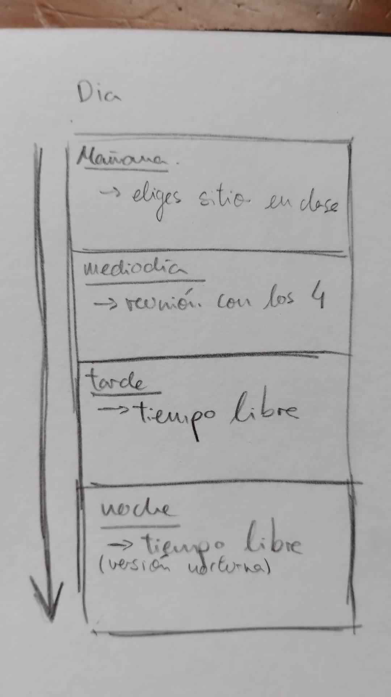
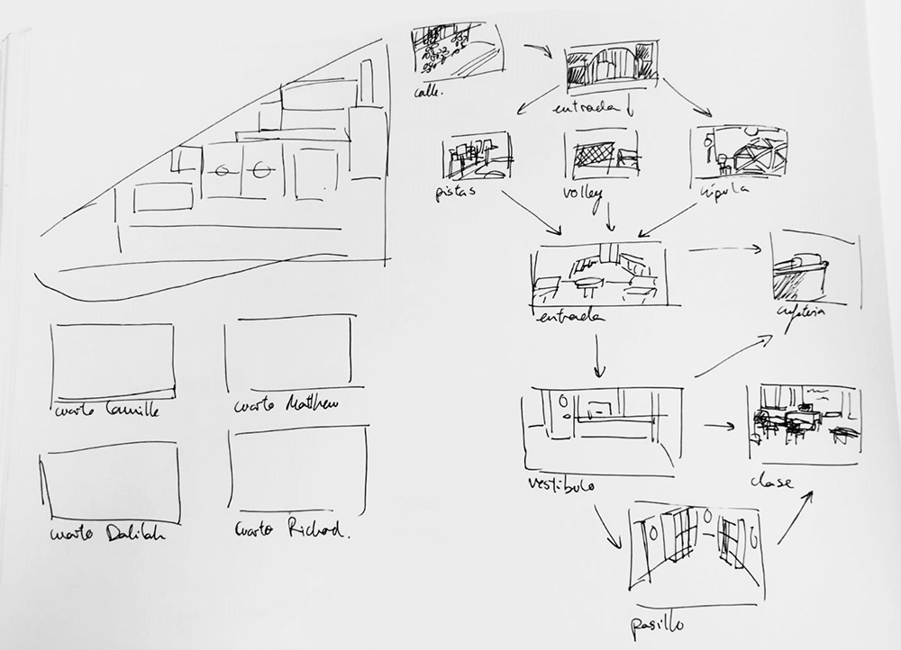
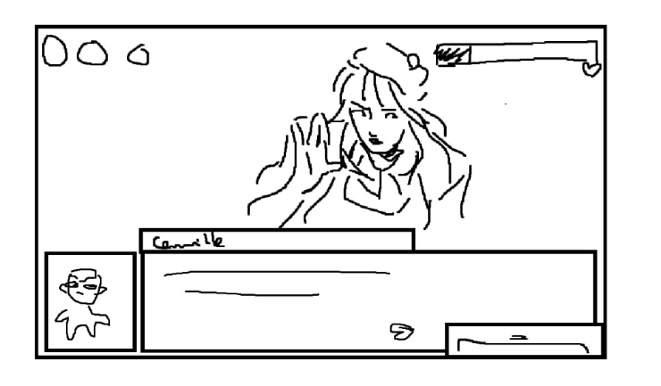
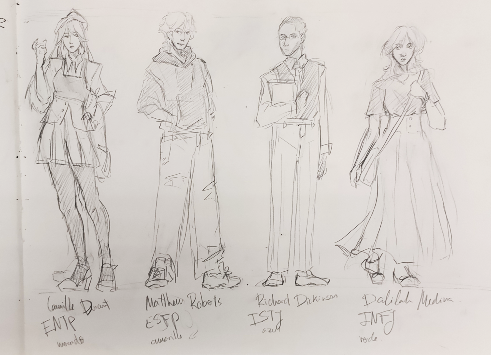

**My Beloved True Interest (MBTI)**

GDD 

Documento de diseño de videojuego  

*Cynthia Tristán Álvarez, David Canelada Velasco, Inés Olimpia Primo López, Paula  Alemany Rodriguez*  

*Grupo 9*  

0. Apuntes con el profe en el laboratorio.  
- árbol de localizaciones  
- árbol de decisiones  
- líneas de historia (simplificadas)  
- META JUEGO  
- arcade con cierta aleatoriedad  
  - chocar (colisiones y movimientos)  
  - xenoblade 2  
  - zelda pesca  
  - pingüino  
  - buscar arcade en internet  
  - pacman con un melón (meroman (cocomelon))  
- animaciones UI y personajes las justitas pero alguna guay  
- lo más importante definir el sistema de progresión (cierta complejidad): stats?,  misiones?, inventario, twitter, triggers, flags, actividades  

1. **Ficha técnica**  

***Título*:** My Beloved True Interest  

***Género*:** Novela Visual, Romance, Simulador de citas  ***Target*:** Jóvenes adultos (sin dependencia de género)  ***Rating*:** Todos los públicos  

***Plataforma*:** Windows  

***Modos de juego*:** 1 jugador  

2. **Descripción**  

My Beloved True Interest es una novela visual y simulador de citas en el que el protagonista  establecerá distintas relaciones y eventualmente un romance entre cuatro personajes universitarios en base a las decisiones del jugador, además de experimentar la vida escolar con diferentes actividades diarias.  

3. **Jugabilidad y mecánicas**

El juego se desarrolla a través del punto de vista del protagonista. (Narración en primera  persona todo el tiempo o habrá narrador?) El jugador vivirá su día a día moviéndose por los  distintos escenarios, interactuando con la gente, cumpliendo misiones o distrayéndose un  rato con el móvil.    

Cada día se dividirá en cuatro secciones:   

    3.1. Mañana: Llegar a clase un día más y ponerse a estudiar con la persona favorita.   
    3.2. Medio día: Hora de mentorías. Momento de relacionarse con los cuatro estudiantes  de intercambio.  
    3.3. Tiempo libre: Toca aprovechar para volverse más cercano a alguien, dar vueltas por  el lugar, ayudar un poco…  
    3.4. Actividades nocturnas: Después de un largo día el protagonista llega a su casa para  descansar o hacer alguna otra cosa que le apetezca antes de descansar.  

Dependiendo de las decisiones de diálogo que se tomen puede subir ligeramente la afinidad  con algún personaje o una estadística, hasta 5 puntos en total en ambas.   

Las mecánicas principales que afectan al desarrollo del día a día in-game son:  

4. **Estadísticas:**  

Cada personaje tiene una personalidad y cosas que se le dan mejor y peor; dividimos las  características de cada personaje en  cinco estadísticas:  

  - **Carisma:** Define tus habilidades  sociales. A más carisma más  presencia, liderazgo etc… Eres  más popular  
  - **Amabilidad**: Define cómo te  comportas con los problemas ajenos y en circunstancias sociales comprometidas, también cuanto más amable te  ven de forma más adorable.  
  - **Inteligencia**: Define tu forma de pensar; la objetividad y la eficiencia son la prioridad.  Puede llegar a ser algo repelente.  
  - **Humor:** Define tus habilidades para hacer reir a la gente y llevarte bien con ellos**  
  - **Suerte:** Un poco de suerte puede venir muy bien o tal vez alguien te ayude si tienes  muy mala, nunca se sabe.**  

Puedes simular tu propio personaje[ aquí.](https://cyntrist.github.io/PVLI-MBTIGenerator/)  

5. **Gestión de tiempo:**  

*(esquema de la distribución del día)*  

> Actividades diurnas:  

Al elegir sitio, el jugador tendrá que pasar la mañana estudiando y atendiendo a  clase al lado del estudiante de intercambio correspondiente, lo que puede conllevar  interacciones especiales o puntos de estadísticas/afección.  

> Reuniones:  

El jugador tendrá todos los días una reunión con los cuatro estudiantes de  intercambio juntos para resolver dudas que tengan, preparar actividades con ellos,  conocerse mejor, etc.  

> Tiempo libre:  

Decisión sobre qué actividad hacer de entre las opciones posibles entre las que se  incluyen misiones de personaje, actividades para subir estadísticas, quedadas para  subir el nivel de afección etc.  

> Actividades nocturnas:  

Se podrá completar una actividad más, pero esta vez más corta, lo cual dará menos  puntos de estadísticas o afección o podrá irse a dormir antes.  

> Móvil: 

Durante la partida, el jugador tendrá acceso a su teléfono móvil en cualquier  momento, lo cual le permitirá ver sus objetos guardados, sus redes sociales y  jugar al juego de movil del momento  

> Minijuego:  

Para poder conseguir el final secreto hace falta superar la puntuación máxima  de un minijuego disponible en el móvil del personaje protagonista, accesible  en cualquier momento y basado en físicas.  

> Twitter; misiones:  

` `Mediante la red social, el jugador será capaz de ver las publicaciones de los  estudiantes de intercambio, responderles, interactuar con ellos en cualquier  momento e incluso quedar con ellos. Esto último supondrá el inicio de una  misión en la cual se podrá subir las estadísticas y afinidad.  

> Objetos guardados:  

Durante la partida, se podrán recoger ciertos objetos importantes para la  finalización de ciertas misiones. Una vez en la posesión del jugador, se  podrán ver en el teléfono móvil.  

6. **Niveles de afinidad:**  
    1. **Conocidos**: Ya eres algo más que un mentor para ellos. Os saludais  fuera de clases y tenéis pequeñas charlas.  
    2. **Amigos**: Quedáis juntos para comer o para veros entre clases para  echaros unas risas, hay bromas entre ambos.**  
    3. **Cercanos:** Comienza a confiar en ti para contarte cosas más serías,  ya no solo quedais para echaros unas risas, confiais el uno en el otro.**  
    4. **Enamorados** : Os ponéis algo nerviosos al estar cerca del otro, se tontea un poco…**  
    5. **Pareja**: Uno de los dos se declara y comienzan una relación formal.** 

7. **Controles:**  

Únicamente a través de clics izquierdos, tanto el movimiento por lugares como el  manejo de la interfaz y el avance del texto.  

8. **Diseño de nivel: (árbol de localizaciones)**

Los diferentes lugares donde se desarrolla el juego varían entre la propia universidad y un  cuarto por cada interés romántico, específico de sus niveles máximos de afinidad.  

9. **Visual:**  
    - Arte: 
    
    Los recursos artísticos serán en parte hechos a mano, como las imágenes de  los personajes, y en parte recursos gráficos gratuitos en internet, como los  sonidos o los fondos: imágenes de stock de uso público con un filtro fotográfico  para que luzcan acordes al estilo artístico. Es posible que la interfaz sea  cualquiera de ambas posibilidades.  

    - Logotipo:
    

10. **Interfaz:**  

Contiene la barra de diálogo, el nombre del hablante, la barra de afinidad, accesos al móvil  (twitter, minijuego, opciones) y eventualmente las opciones en cada decisión.  

11. **Contenido:**  
- [Historia: ](https://docs.google.com/document/u/1/d/1SEaM023uNAK0QiblTIUEgQgv2u2XA7PokMP3-icuqXE/edit) 

**Inicio:** Comienza un nuevo cuatrimestre en la Universidad Mbti (Elegir nombre  en algún momento). Como mentor, te asignan que tutorices a unos nuevos  estudiantes de intercambio que han llegado, les introduzcas un poco el campus  y como van todas las cosas por ahí.  

**Desarrollo:** Los siguientes días deberás continuar con tu vida mientras  ![ref1]mentorizas a estos alumnos. Según vais volviéndonos más cercanos ocurrirán  diferentes eventos y quedadas con ellos.  

**Final**: El juego tendrá tres posibles finales:  

> Acabas saliendo con uno de los cuatro intereses románticos,  teniendo una linda redacción.

> Finalizas el cuatrimestre con una relación poliamorosa con todos  los intereses.  

> No sales con ninguno y simplemente te quedas como amigo con  ellos.  

- Personajes   
1. [Camille Durant ](https://docs.google.com/document/u/0/d/1v4gigCsDng7JQmfwRubfaLWtL3erMDjxguRyTlj8iIw/edit)(ENTP):  

Joven francesa, reciente presidente del consejo estudiantil además de  miembro del club de debate. Innovadora y carismática, le encanta  argumentar y resolver problemas difíciles. Su mayor defecto es su  impaciencia y elitismo.  

2. [Delilah Medina ](https://docs.google.com/document/u/0/d/1V3rdjy61Q6TpM6r797blQUZxC5nKlTyx-DPhaKCxgM4/edit)(INFJ):  

Joven filipina, va más por su cuenta y es bastante tímida pero nunca  dudará en ayudar a alguien que lo necesita. Le cuesta ser dura  cuando es ella la que sufre pero no permite que dañen a la gente que  quiere. Su mayor defecto es que no sabe decir que no para contentar  a otros.  

3. [Matthew Roberts ](https://docs.google.com/document/u/0/d/1p0xoau-nbyLUvzDVfUtpeke1cKZtxNLzAB4rIMw4C8w/edit)(ESFP):  

Joven estadounidense con el gran sueño de convertirse en un popular  streamer de videojuegos. A pesar de sus pocas ganas de estudiar y  su necesidad de llamar la atención con su humor, es una persona  amistosa que siempre está dispuesta a pasárselo bien.  

4. [Richard Dickinson ](https://docs.google.com/document/u/0/d/1R35LPw43lF559LUG4YRQf2GohQfiwhMnbFnePbbvIvo/edit)(ISTJ):  

12. **Referencias:**
    1. [Corazón de melón ](https://www.corazondemelon.es/)(Beemoov, 2011)  
    1. Persona 5 (ATLUS, 2016)  
    1. Danganronpa (Spike Chunsoft, 2010)  
    1. Mystic Messenger (Cheritz, 2016)  
    1. Doki Doki Literature Club (Dan Salvato, 2017)  
    1. Monster Prom (Beautiful Glitch, 2018)  
    1. My Horse Prince (USAYA, 2016) (tengo miedo de preguntar acerca de esto)  

